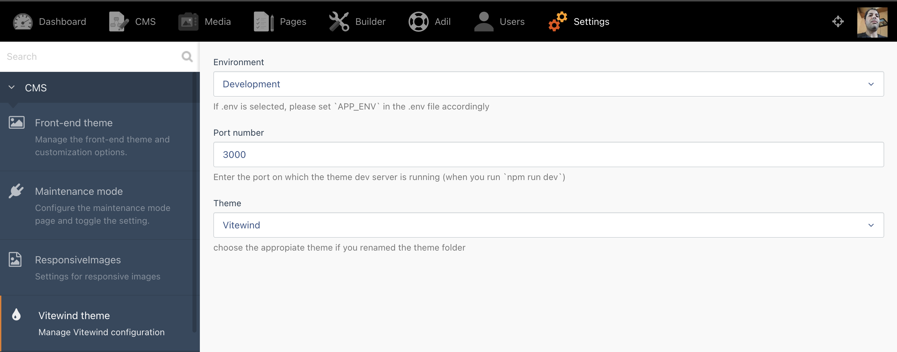
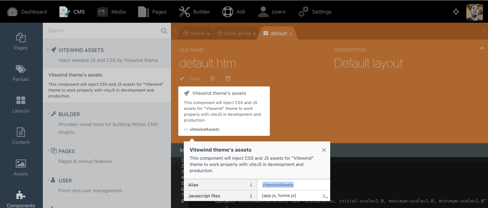
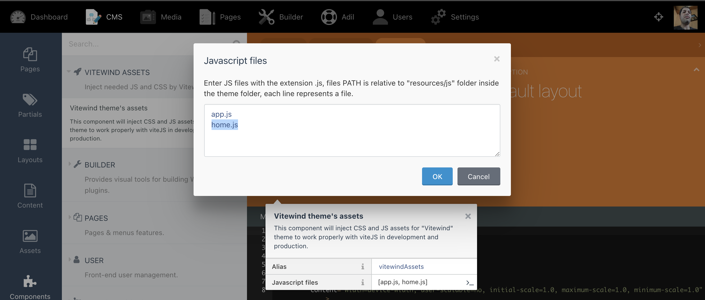

<h1 align='center'>Vitawind theme</h1>

<p align='center'><a href="https://github.com/tailwindlabs/tailwindcss">💨 Tailwind CSS</a> and <a href="https://github.com/vitejs/vite"> ⚡️Vite</a>, for <a href="https://octobercms.com"> 🍂 OctoberCMS</a>  & <a href="https://wintercms.com/">❄️ WinterCMS</a><br>
</p>
<br/>
<br/>
<p align='center'>
  
</p>
<br/>

## Installation

Go to your backend to **Settings > System > Updates & Plugins** and install the theme `Chkilel.Vitawind`, then install the `VitewindManager` Plugin. (just copy & paste the PluginID below and put it in the search box.)
```
    - Chkilel.VitewindManager
```
> Cannot work without Vitewind Manager plugin, please install it to use the theme.

## Theme Setup

You must first install the theme dependencies. **In the theme folder**, run:

```
npm install // or yarn install
```

## Theme settings
Go to your backend to **Settings > Vitewind theme**, and configure the following settings:



        Environment:
            - Use `.env` configuration  : will use the `APP_ENV` value in the .env file
            - Development               : if you are working on the theme development (npm run dev)
            - Production                : if you are in production, the theme must be built before (npm run build)

        Port number : Enter the port on which the theme dev server is running (when you run `npm run dev`), default to 3000.

        Theme: select the appropiate theme, if you modify the theme name in the `theme.yaml` file.


## Vite config file

> - If you rename the theme folder, please adjust the name [VITAWIND_FOLDER] in `vite.config.js` accordingly.
> - If you need many JS files for your layouts, add them all to the `build.rollupOptions.input` config array to be compiled.

```javascript
import WindiCSS from 'vite-plugin-windicss'
export default ({command}) => ({
    base: command === 'serve' ? '' : '/themes/[VITAWIND_FOLDER]/public/build/', // Addjust the name of the theme
    publicDir: 'fake_dir_so_nothing_gets_copied',
    processCssUrls: true,
    build: {
        manifest: true,
        outDir: 'public/build',
        rollupOptions: {
            input: [
                'resources/js/app.js',
                'resources/js/home.js',
                // Add here all the files you need if you load different javascript code in each layout
                'ressource/js/myFirstAddedFile.js',
                'ressource/js/mySecondAddedFile.js',
                ...
            ],
        },
    },
    plugins: [...],
});
```

## Layout component

The **Vitewind plugin** register a layout component to inject JS and CSS assets,manage **hot reload** in Development and inject **build assets** in production.



Put the component in the layout and set the JS files you need to load for each layout, you can use differente JS files for each layout.




## Development
Run the command below in your theme folder:

```
npm run dev // or yarn dev

```
The theme DEV server will start on `http://localhost:3000/` and listen to any modification in your `.htm` files ( layouts, pages, partials,...).
then, you can visite your site on its usual URL and start development.

> Note the **port of the dev server**, if different from 3000 you need to adjust it in the backend settings.

## Production build

Use `npm run build` to compile your assets.

```
npm run build // or yarn build
```
> Don't forget to adjust the `Enviroment` to **production** in the backend settings.

## Theme License

MIT License - check out [LICENSE](LICENSE) file for MIT license details.

## Changelog

#### 1.0.0 : initial release
- Vitawind: the power of Tailwind CSS and the speed of Vite JS
